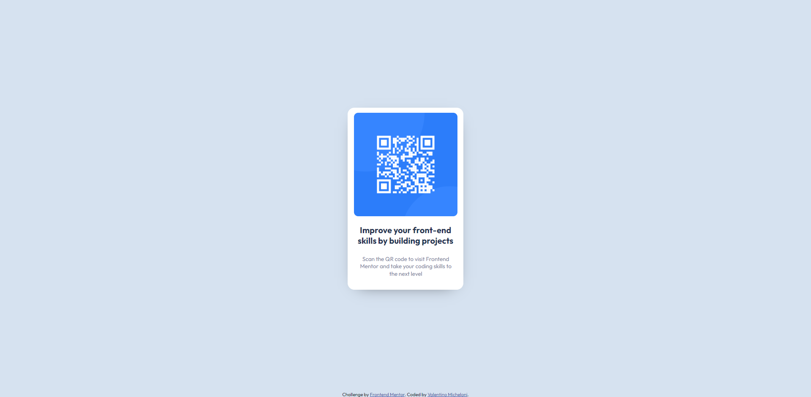

# Frontend Mentor - QR code component solution

This is a solution to the [QR code component challenge on Frontend Mentor](https://www.frontendmentor.io/challenges/qr-code-component-iux_sIO_H). Frontend Mentor challenges help you improve your coding skills by building realistic projects. 

## Overview

### Screenshot

### Links

- Live Site URL: [QR-Component](https://qr-component-valemiche.netlify.app/)

## My process

### Built with

- Semantic HTML5 markup
- CSS custom properties
- Flexbox
- CSS Grid
- Mobile-first workflow

## Author

- Website - [Valentino Micheloni](https://valemiche.com.ar)
- Frontend Mentor - [@upon-X](https://www.frontendmentor.io/profile/upon-X)
- Github - [@upon-X](https://github.com/upon-X)
- Linkedin - [@valentinomicheloni](https://www.linkedin.com/in/valentino-micheloni/)